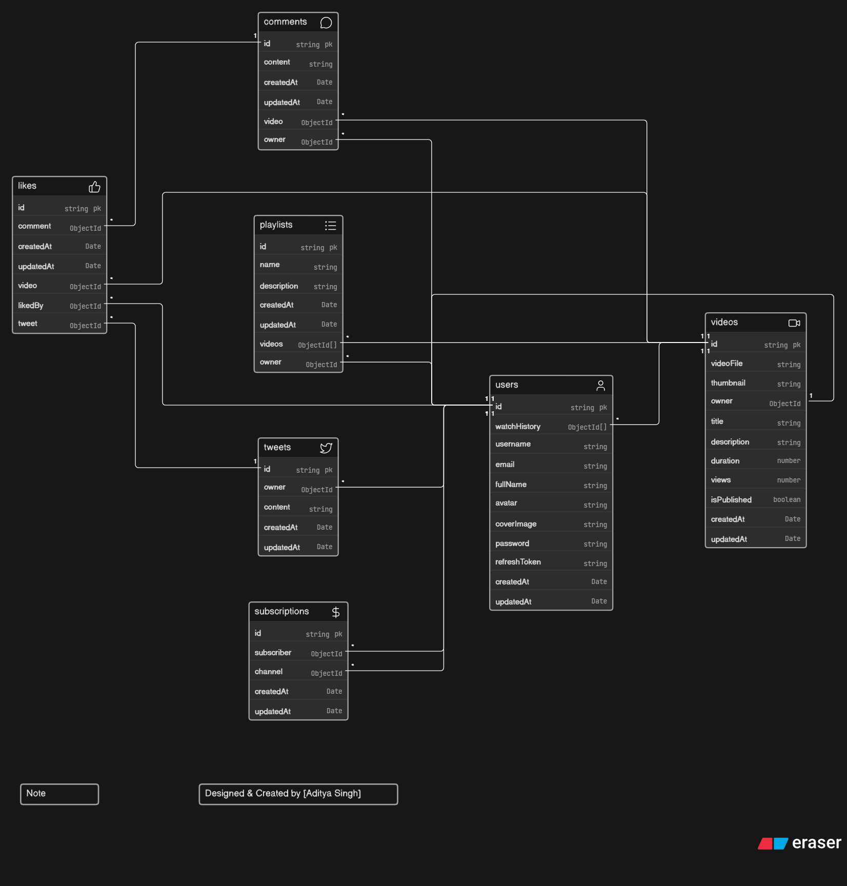

# Social Media Backend API

Version: **v1.0.0 - Backend Complete**

A production-style backend API for a YouTube and Twitter inspired social media platform. The project focuses only on the server side: authentication, media uploads, videos, tweets, comments, likes, playlists, subscriptions, channel dashboard data, and user account management.

This repository does not include a frontend. It is designed to be consumed by a web app, mobile app, Postman, Thunder Client, or any HTTP client.

## Interview Preparation Guide

For a complete v1 project walkthrough, architecture explanation, interview questions and answers, API behavior, security discussion, scaling notes, and presentation script, see [INTERVIEW_PREP_V1.md](./INTERVIEW_PREP_V1.md).

## Project Status

**v1 backend is complete.**

The API includes the main backend modules required for a social media platform:

- User registration, login, logout, token refresh, and account updates
- JWT based authentication using access and refresh tokens
- Secure password hashing with bcrypt
- Avatar, cover image, video, and thumbnail uploads using Multer and Cloudinary
- Video publishing, updating, deleting, listing, and publish status toggling
- Tweet creation, updating, deletion, and user tweet listing
- Comments on videos
- Likes for videos, comments, and tweets
- User subscriptions and channel subscriber data
- Playlists with add/remove video support
- Channel dashboard stats and channel videos
- Watch history
- Healthcheck route
- Centralized API response and error handling helpers

## Tech Stack

- **Node.js**
- **Express.js**
- **MongoDB**
- **Mongoose**
- **JWT**
- **bcrypt**
- **Cloudinary**
- **Multer**
- **cookie-parser**
- **CORS**
- **mongoose-aggregate-paginate-v2**
- **Nodemon**
- **Prettier**

## Project Model Schema

<p align="center">
  
</p>

## Folder Structure

```txt
.
├── assets/
│   └── Project_Model.png
├── public/
│   └── temp/
│       └── .gitkeep
├── src/
│   ├── controllers/
│   ├── db/
│   ├── middlewares/
│   ├── models/
│   ├── routes/
│   ├── utils/
│   ├── app.js
│   ├── constants.js
│   └── index.js
├── .env
├── .gitignore
├── package.json
└── README.md
```

## Installation

Clone the repository:

```bash
git clone git@github.com:Aditya-is-op200/Social-Media-Backend-API.git
cd Social-Media-Backend-API
```

Install dependencies:

```bash
npm install
```

Create a `.env` file in the project root:

```env
PORT=8000
CORS_ORIGIN=http://localhost:5173
MONGODB_URI=mongodb+srv://your-mongodb-uri

ACCESS_TOKEN_SECRET=your-access-token-secret
ACCESS_TOKEN_EXPIRATION=1d

REFRESH_TOKEN_SECRET=your-refresh-token-secret
REFRESH_TOKEN_EXPIRATION=10d

CLOUDINARY_CLOUD_NAME=your-cloudinary-cloud-name
CLOUDINARY_API_KEY=your-cloudinary-api-key
CLOUDINARY_API_SECRET=your-cloudinary-api-secret

NODE_ENV=development
```

Start the development server:

```bash
npm run dev
```

Default local server:

```txt
http://localhost:8000
```

## Environment Variables

| Variable | Required | Description |
| --- | --- | --- |
| `PORT` | No | Server port. Defaults to `8000`. |
| `CORS_ORIGIN` | Yes | Frontend/client origin allowed by CORS. |
| `MONGODB_URI` | Yes | MongoDB connection URI. The app appends the `videotube` database name. |
| `ACCESS_TOKEN_SECRET` | Yes | Secret used to sign JWT access tokens. |
| `ACCESS_TOKEN_EXPIRATION` | Yes | Access token expiry, for example `1d`. |
| `REFRESH_TOKEN_SECRET` | Yes | Secret used to sign JWT refresh tokens. |
| `REFRESH_TOKEN_EXPIRATION` | Yes | Refresh token expiry, for example `10d`. |
| `CLOUDINARY_CLOUD_NAME` | Yes | Cloudinary cloud name. |
| `CLOUDINARY_API_KEY` | Yes | Cloudinary API key. |
| `CLOUDINARY_API_SECRET` | Yes | Cloudinary API secret. |
| `NODE_ENV` | No | Runtime environment. Defaults to `development` in healthcheck output. |

## API Base URL

```txt
/api/v1
```

## API Endpoints

### Healthcheck

| Method | Endpoint | Auth | Description |
| --- | --- | --- | --- |
| `GET` | `/api/v1/healthcheck` | No | Check API health and environment status. |

### Users

| Method | Endpoint | Auth | Description |
| --- | --- | --- | --- |
| `POST` | `/api/v1/users/register` | No | Register a new user with avatar and optional cover image upload. |
| `POST` | `/api/v1/users/login` | No | Login with username/email and password. |
| `POST` | `/api/v1/users/logout` | Yes | Logout current user and clear refresh token. |
| `POST` | `/api/v1/users/refresh-token` | Cookie/token | Generate a new access token using a refresh token. |
| `POST` | `/api/v1/users/change-password` | Yes | Change current user's password. |
| `GET` | `/api/v1/users/current-user` | Yes | Get currently authenticated user. |
| `PATCH` | `/api/v1/users/update-account` | Yes | Update account details. |
| `PATCH` | `/api/v1/users/avatar` | Yes | Update user avatar. |
| `PATCH` | `/api/v1/users/cover-image` | Yes | Update user cover image. |
| `GET` | `/api/v1/users/c/:username` | Yes | Get a channel profile by username. |
| `GET` | `/api/v1/users/history` | Yes | Get current user's watch history. |

### Videos

| Method | Endpoint | Auth | Description |
| --- | --- | --- | --- |
| `GET` | `/api/v1/videos` | Yes | Get all videos with query support from the controller. |
| `POST` | `/api/v1/videos` | Yes | Publish a video with video file and thumbnail upload. |
| `GET` | `/api/v1/videos/:videoId` | Yes | Get video details by ID. |
| `PATCH` | `/api/v1/videos/:videoId` | Yes | Update video details and optionally thumbnail. |
| `DELETE` | `/api/v1/videos/:videoId` | Yes | Delete a video. |
| `PATCH` | `/api/v1/videos/toggle/publish/:videoId` | Yes | Toggle video publish status. |

### Tweets

| Method | Endpoint | Auth | Description |
| --- | --- | --- | --- |
| `POST` | `/api/v1/tweets` | Yes | Create a tweet. |
| `GET` | `/api/v1/tweets/user/:userId` | Yes | Get tweets created by a user. |
| `PATCH` | `/api/v1/tweets/:tweetId` | Yes | Update a tweet. |
| `DELETE` | `/api/v1/tweets/:tweetId` | Yes | Delete a tweet. |

### Comments

| Method | Endpoint | Auth | Description |
| --- | --- | --- | --- |
| `GET` | `/api/v1/comments/:videoId` | Yes | Get comments for a video. |
| `POST` | `/api/v1/comments/:videoId` | Yes | Add a comment to a video. |
| `PATCH` | `/api/v1/comments/c/:commentId` | Yes | Update a comment. |
| `DELETE` | `/api/v1/comments/c/:commentId` | Yes | Delete a comment. |

### Likes

| Method | Endpoint | Auth | Description |
| --- | --- | --- | --- |
| `POST` | `/api/v1/likes/toggle/v/:videoId` | Yes | Like or unlike a video. |
| `POST` | `/api/v1/likes/toggle/c/:commentId` | Yes | Like or unlike a comment. |
| `POST` | `/api/v1/likes/toggle/t/:tweetId` | Yes | Like or unlike a tweet. |
| `GET` | `/api/v1/likes/videos` | Yes | Get videos liked by the current user. |

### Playlists

| Method | Endpoint | Auth | Description |
| --- | --- | --- | --- |
| `POST` | `/api/v1/playlist` | Yes | Create a playlist. |
| `GET` | `/api/v1/playlist/:playlistId` | Yes | Get playlist details by ID. |
| `PATCH` | `/api/v1/playlist/:playlistId` | Yes | Update playlist details. |
| `DELETE` | `/api/v1/playlist/:playlistId` | Yes | Delete a playlist. |
| `PATCH` | `/api/v1/playlist/add/:videoId/:playlistId` | Yes | Add a video to a playlist. |
| `PATCH` | `/api/v1/playlist/remove/:videoId/:playlistId` | Yes | Remove a video from a playlist. |
| `GET` | `/api/v1/playlist/user/:userId` | Yes | Get playlists owned by a user. |

### Subscriptions

| Method | Endpoint | Auth | Description |
| --- | --- | --- | --- |
| `GET` | `/api/v1/subscriptions/c/:channelId` | Yes | Get subscribers for a channel. |
| `POST` | `/api/v1/subscriptions/c/:channelId` | Yes | Subscribe or unsubscribe to a channel. |
| `GET` | `/api/v1/subscriptions/u/:subscriberId` | Yes | Get channels subscribed to by a user. |

### Dashboard

| Method | Endpoint | Auth | Description |
| --- | --- | --- | --- |
| `GET` | `/api/v1/dashboard/stats` | Yes | Get channel statistics. |
| `GET` | `/api/v1/dashboard/videos` | Yes | Get videos for the authenticated user's channel dashboard. |

## Authentication

Protected routes use the `verifyJWT` middleware. The API expects an access token from either:

- `accessToken` cookie
- `Authorization: Bearer <token>` header

The login and refresh-token flows issue access and refresh tokens. Refresh tokens are stored on the user document and are used to generate new access tokens.

## File Uploads

The backend uses Multer for temporary local file handling and Cloudinary for permanent media storage.

Upload fields used by the API:

| Route | Field Name |
| --- | --- |
| `POST /api/v1/users/register` | `avatar`, `coverImage` |
| `PATCH /api/v1/users/avatar` | `avatar` |
| `PATCH /api/v1/users/cover-image` | `coverImage` |
| `POST /api/v1/videos` | `videoFile`, `thumbnail` |
| `PATCH /api/v1/videos/:videoId` | `thumbnail` |

Temporary files are stored in:

```txt
public/temp
```

The `.gitignore` keeps uploaded temp files out of Git while preserving the folder with `.gitkeep`.

## Database Models

### User

Stores account details, avatar and cover image URLs, password hash, refresh token, and watch history.

### Video

Stores Cloudinary video URL, thumbnail URL, title, description, duration, view count, publish status, and owner.

### Tweet

Stores short text posts created by users.

### Comment

Stores comments attached to videos.

### Like

Stores likes for videos, comments, and tweets.

### Playlist

Stores named video collections owned by users.

### Subscription

Stores subscriber-to-channel relationships between users.

## Response Format

The project uses shared API helpers:

- `ApiResponse` for successful responses
- `ApiError` for operational errors
- `asyncHandler` for wrapping async route handlers

Errors are passed to the global Express error middleware in `src/app.js`.

## Available Scripts

```bash
npm run dev
```

Runs the backend with Nodemon:

```bash
nodemon -r dotenv/config --experimental-json-modules src/index.js
```

## Version 1 Completion Notes

This v1 marks the backend API as complete for the first usable version of the project. It contains the core server-side features for a social media platform and is ready for:

- Frontend integration
- API testing through Postman or Thunder Client
- Deployment setup
- Additional automated tests
- API documentation expansion with request/response examples

## Future Improvements

- Add automated unit and integration tests
- Add Swagger/OpenAPI documentation
- Add rate limiting and request sanitization
- Add centralized logging
- Add pagination documentation for list endpoints
- Add Docker support
- Add production deployment guide
- Add frontend client

## Author

Aditya Singh
